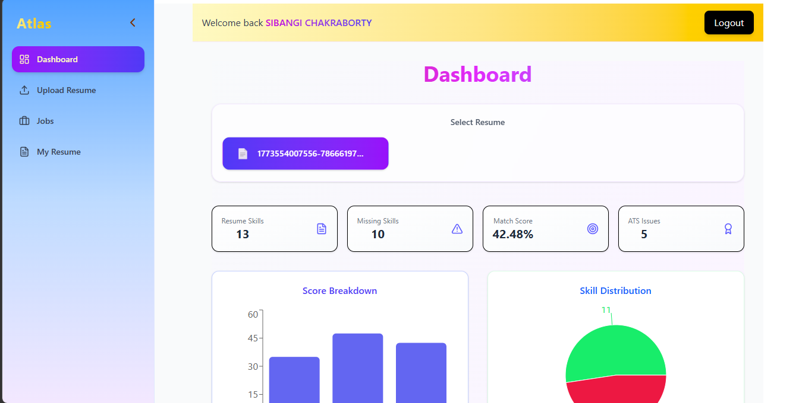
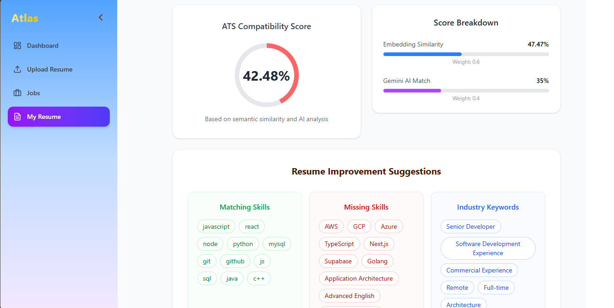
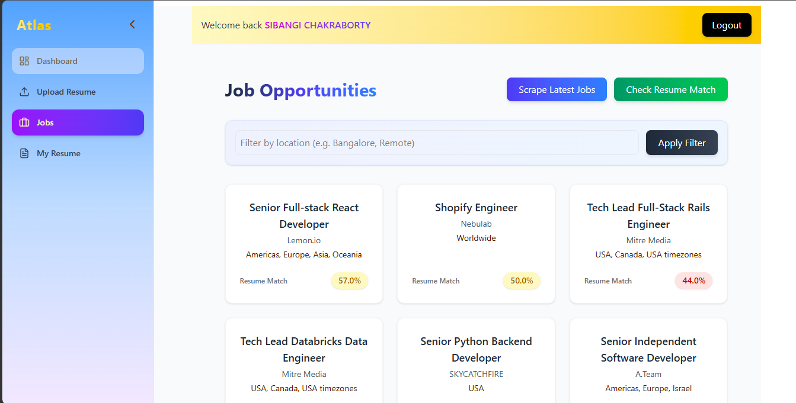
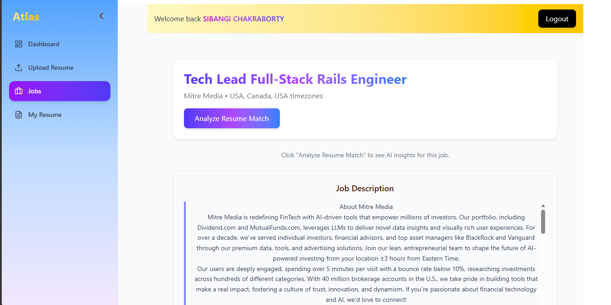

#  Atlas - Resume and Job Matcher

An **AI-powered Personalized Resume Analyzer** that compares a candidate’s resume with a job description and generates an **ATS-style match score**, identifies **skill gaps**, and provides **actionable suggestions** to improve the resume. It also provides **job scrapping** as an option for users to search for their ideal job.

This project helps job seekers understand how well their resume aligns with a job role and what improvements they should make to increase their chances of getting shortlisted.

---

#  Features

- Upload Resume (PDF)  
- Paste Job Description  
- Resume–Job Match Score  
- Skill Gap Analysis  
- ATS Issue Detection  
- Resume Improvement Suggestions  
- Resume Overview Dashboard  
- Job Scraping – Fetch real job listings automatically
- Analyze resume directly against scraped job postings

---

#  How It Works

1️ User uploads their **resume (PDF)**  
2️ User can either:
    Paste a job description manually, or
    Select a job from scraped listings 
3️ The backend **extracts text from the resume**  
4️ Skills and keywords are compared with the job description  
5️ The system generates:

-  ATS Match Score
-  Missing Skills
-  ATS Issues
-  Suggestions to improve the resume

---

#  Tech Stack

## Frontend
-  React
-  Tailwind CSS
-  Axios

## Backend
-  Node.js
-  Express.js

## Database
-  MongoDB

## Other Tools
-  PDF Resume Parsing
-  Keyword & Skill Matching
-  Job Listings Scraping
-  Resume Analytics Dashboard

---

#  Screenshots

## Home Page


## Resume Analysis


## Job Listings


## Skill Gap Analysis


---

#  Installation

## 1️ Clone the repository

```bash
git clone https://github.com/Sibangi15/Atlas-JobMatcher.git
```

---

## 2️ Install Backend Dependencies

```bash
cd server
npm install
```

Run the backend server

```bash
npm start
```

---

## 3️ Install Frontend Dependencies

```bash
cd client
npm install
npm run dev
```

---

#  Why This Project?

Many resumes fail **Applicant Tracking Systems (ATS)** because they lack relevant keywords or skills required by the job.

This project helps candidates:

- Understand **how ATS systems evaluate resumes**
- Identify **missing skills**
- Improve their resume for **better job matching**
- Compare resumes with **real job listings fetched automatically**

---

#  Future Improvements

🔹 AI-powered resume rewriting  
🔹 Job recommendation system  
🔹 LinkedIn profile analysis  
🔹 Resume templates generator  
🔹 AI interview preparation assistant  

---

#  Author

**Sibangi Chakraborty**

 BTech CSE Student  
 Web Development Enthusiast  

---

#  Support

If you like this project, consider **starring the repository** ⭐

It helps others discover the project and motivates further improvements!